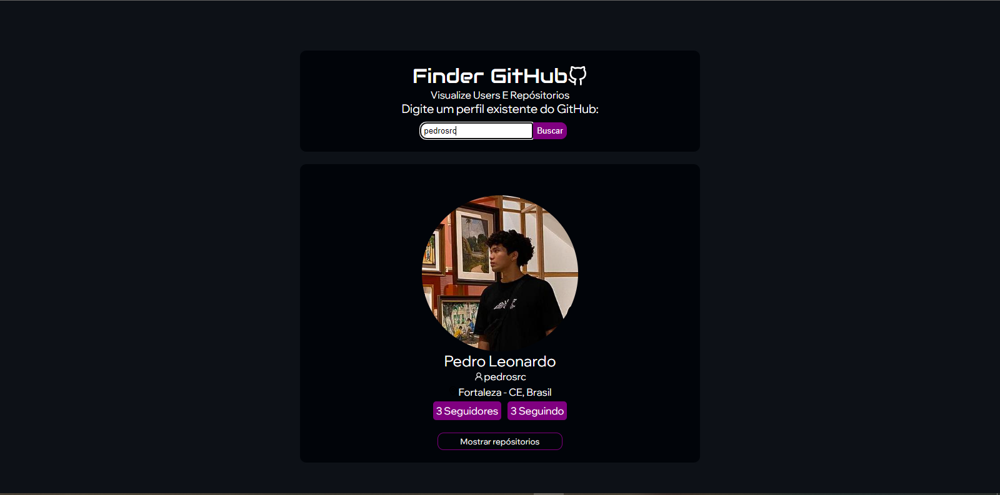
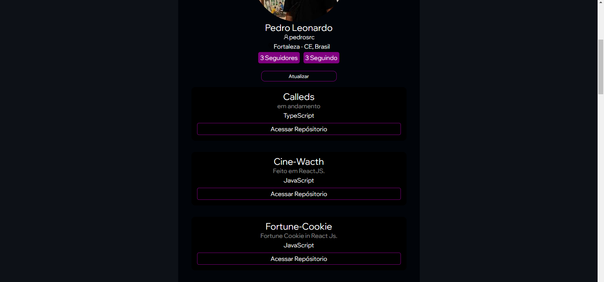

<h1 align="center": center">Finder GitHub</h1>
<h2>1 - Tela Inicial:</h2>

Na tela inicial contém o espaço onde o usúario pode colocar um user existente do GitHub

<h2>2 - Tela De Repósitorios:</h2>

Nessa tela, você pode ver a listagem de todos os repósitorios do user que foi inserido. Nele contém o nome, descrição e a linguaguem de programação de maior porcentagem existente no projeto.

